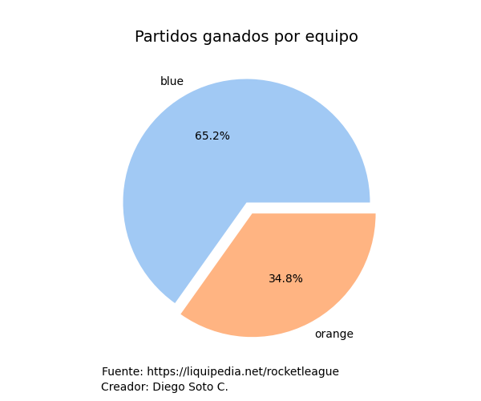
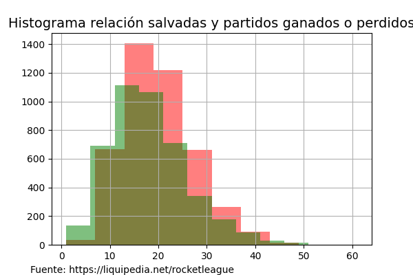
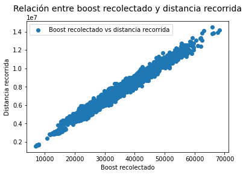
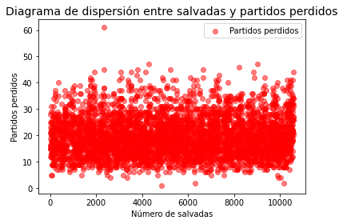
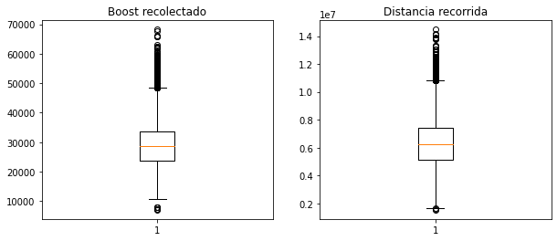

# Proyecto predicción de partidos Rocket League
Rocket League es un videojuego que combina elementos de futbol y carreras de autos, en pocas palabras es un juego donde se debe jugar futbol (metiendo goles en el arco contrario) con autos que al ser propulsados por nitro pueden incluso volar.
Hay distintos modos de juego online y offline, pero este proyecto se centrará en el modo principal en e-sport que es en equipos de 3 vs. 3

Este proyecto está enfocado en realizar un análisis predictivo para saber los ganadores de partidos y resolver un problema de **clasificación** con uno o más dataset extraídos del siguiente link
Link dataset: https://www.kaggle.com/datasets/dylanmonfret/rlcs-202122

Ahora bien, los dataset son datos recogidos de una página especializada en videojuegos competitivos (https://liquipedia.net/rocketleague), por lo tanto, en un futuro quizás sea extraída la información por medio de técnicas de web scraping

- [Glosario](glosario.md)
- [Descripción datasets](datasets/datasets.md)

---
El análisis exploratorio y limpieza de datasets individuales se explican en los siguientes archivos:

- [matches_by_teams](datasets/matches_by_teams.md)
- [matches_by_players](datasets/matches_by_players.md)

---
# Análisis preliminar
A modo exploratorio se utilizará el dataset de  **[matches_by_teams](datasets/matches_by_teams.md)**, ya que preliminarmente es el que puede tener información más relevante al ser el que guarda lo referente a los encuentros (no a los partidos individuales), sin embargo, es posible utilizar otro basándonos en las necesidades.

## Hipótesis preliminar
Inicialmente, hay 3 hipótesis para las que podemos buscar respuestas y se responderán con algunos gráficos:
- ¿Hay alguna inclinación en cuanto a los partidos ganados por esquina (azul/naranja) dada?


- ¿Hay una relación entre las salvadas o salvadas épicas realizadas y los partidos ganados?


- ¿Se podría decir que mientras más distancia se recorre, más boost se utiliza?


### Conclusiones preliminares
En base al primer gráfico podemos concluir que hay una clara inclinación que gane la esquina azul, sin embargo no podemos asegurar que no se deba a factures externos, de todas maneras se podría utilizar este parámetro para el modelo de datos que se creará.

Por otro lado, con el segundo gráfico por ahora, no podemos concluir que hay una relación directa o indirecta en cuanto a los partidos ganados o perdidos versus la cantidad de salvadas. De todas maneras, hay frecuencias más altas en los partidos perdidos, esto puede deberse a que realmente hubo más salvadas porque también hubo más defensa, por lo tanto, se podría decir que, la cantidad de partidos perdidos aumenta mientras más salvadas haya porque la mayor parte del tiempo se defendieron de los ataques del oponente.

Por último, gracias al tercer gráfico podemos ver una clara correlación entre el boost recolectado y la distancia recorrida en el campo, de todas maneras, se buscarán outliers para evitar malos resultados a futuro

Para seguir con la exploración de los datos, se dará una nueva visión para todos los gráficos, realmente esto se hará para confirmar que tan correcto podrían estar

---
En primer lugar solo para verificar que tanto influyen los nulos en la agrupación del primer gráfico, se generará otra agrupación, pero del df "nulos" y así se verá que tan diferentes pueden ser los datos

```python
nulos.groupby('winner')[['core_saves']].sum()
```

| `core_saves` | `winner` |
| :----------: | -------: |
| False        |    566.0 |
| True         |    536.0 |

Se puede apreciar que la diferencia es muy marginal como para considerarla, por lo tanto, el primer gráfico se consideraría correcto

---
En cuanto a lo siguiente, se intentará hacer un diagrama de dispersión que muestre si hay una relación entre los partidos perdidos y las salvadas



Gracias a este gráfico podemos decir que no hay correlación entre los partidos perdidos y las salvadas realizadas, por lo tanto, se puede descartar.

---
Por último, por el tercer gráfico donde se apreció una relación entre el boost recolectado y la distancia recorrida, se buscarán outliers con un gráfico de cajas y bigote


Gracias a estos últimos gráficos se puede apreciar que en ambos casos la concentración mayor en outliers superiores. Ahora bien, considerando que en ambas variables esto se repite lo podríamos clasificar como outliers colectivos y no necesariamente una suciedad en la base, por lo tanto, podría abrir la posibilidad a otros fenómenos que se estudiarán más adelante

# Parte 2
En la segunda parte intentaré resolver las siguientes preguntas de análisis
- ¿Cuáles son los equipos que más partidos ganaron?
- ¿En qué regiones se encuentran?

Al realizar el análisis de forma general y ver los primeros 10 equipos que ganaron más partidos, da para pensar, ya que al ser un torneo pasado, ya se saben los resultados, el ganador fue "TEAM BDS" que está en tercer lugar con más partidos ganados, y el que está en segundo lugar "TOKYO VERDY ESPORTS", en el general quedó solo entre los 20 mejores, por lo tanto, puede ser que no tenga mucha relación si lo vemos desde ese punto de vista. Ahora bien, se podría hacer el mismo análisis separado por región

```text
Resultados para la región: Oceania

         team_name  winner team_region
         RENEGADES      49     Oceania
GROUND ZERO GAMING      37     Oceania
       DIRE WOLVES      33     Oceania
         FORKIDDEN      29     Oceania
       BANDITS ESC      23     Oceania
       R!OT GAMING      23     Oceania
        TEAM BLISS      23     Oceania
         BIG GOOSE      22     Oceania
          PIONEERS      22     Oceania
        PHYSICISTS      21     Oceania


Resultados para la región: North America

          team_name  winner   team_region
         G2 ESPORTS      62 North America
        NRG ESPORTS      51 North America
          FAZE CLAN      47 North America
           VERSION1      46 North America
SPACESTATION GAMING      45 North America
              ROGUE      40 North America
 SUSQUEHANNA SONIQS      37 North America
       GHOST GAMING      32 North America
     OXYGEN ESPORTS      31 North America
          TEAM ENVY      31 North America


Resultados para la región: Asia-Pacific South

            team_name  winner        team_region
                  NSF      27 Asia-Pacific South
    DARK RIFT ESPORTS      27 Asia-Pacific South
        FROST ESPORTS      23 Asia-Pacific South
           ASIA MANJI      21 Asia-Pacific South
           THREE RATS      19 Asia-Pacific South
            GOD SPEED      18 Asia-Pacific South
FRIENDLY FIRE ESPORTS      18 Asia-Pacific South
              SHOGUNS      16 Asia-Pacific South
     ASPHYX'S MINIONS      15 Asia-Pacific South
    GAIMIN GLADIATORS      15 Asia-Pacific South


Resultados para la región: Middle East & North Africa

      team_name  winner                team_region
   TEAM FALCONS      46 Middle East & North Africa
SANDROCK GAMING      45 Middle East & North Africa
          ANKAA      34 Middle East & North Africa
  THE ULTIMATES      28 Middle East & North Africa
      25ESPORTS      26 Middle East & North Africa
     REVOLUTION      21 Middle East & North Africa
           COLA      20 Middle East & North Africa
         SCYTES      19 Middle East & North Africa
YOU'RE THROWING      18 Middle East & North Africa
 FOREST HUNTERS      17 Middle East & North Africa


Resultados para la región: Europe

       team_name  winner team_region
        TEAM BDS      56      Europe
      TEAM QUESO      46      Europe
        DIGNITAS      43      Europe
    KARMINE CORP      40      Europe
        ENDPOINT      37      Europe
   GUILD ESPORTS      37      Europe
   EVIL GENIUSES      35      Europe
    SMPR ESPORTS      33      Europe
       00 NATION      32      Europe
WILLIAMS RESOLVE      29      Europe


Resultados para la región: South America

     team_name  winner   team_region
 FURIA ESPORTS      56 South America
   KRÜ ESPORTS      37 South America
    NOVUS AEVI      32 South America
       ELEVATE      31 South America
  ERA ETERNITY      31 South America
       ENDGAME      29 South America
VIPERS ESPORTS      29 South America
 NOBLE ESPORTS      28 South America
      ATYPICAL      24 South America
  TRUE NEUTRAL      22 South America


Resultados para la región: Asia-Pacific North

          team_name  winner        team_region
TOKYO VERDY ESPORTS      60 Asia-Pacific North
          DETONATOR      48 Asia-Pacific North
          SHIROGANE      33 Asia-Pacific North
       TEAM GANDERS      32 Asia-Pacific North
                NOR      32 Asia-Pacific North
            NIMMT55      30 Asia-Pacific North
              ALOHA      29 Asia-Pacific North
       TRUE PARROTS      29 Asia-Pacific North
 GRACESBLAZE REFINE      26 Asia-Pacific North
           XAYFHERS      26 Asia-Pacific North


Resultados para la región: Sub-Saharan Africa

         team_name  winner        team_region
     PIRATES EXDEE      53 Sub-Saharan Africa
    BRAVADO GAMING      40 Sub-Saharan Africa
               ATK      34 Sub-Saharan Africa
    TEAM ESPIONAGE      25 Sub-Saharan Africa
       AIPX GAMING      25 Sub-Saharan Africa
      DNMK ESPORTS      23 Sub-Saharan Africa
               PWB      20 Sub-Saharan Africa
             UNITY      20 Sub-Saharan Africa
   ROYALTY ESPORTS      18 Sub-Saharan Africa
LOST LEGION GIANTS      17 Sub-Saharan Africa


Resultados para la región: nan

Empty DataFrame
Columns: [winner, team_name, team_region]
Index: []
```
