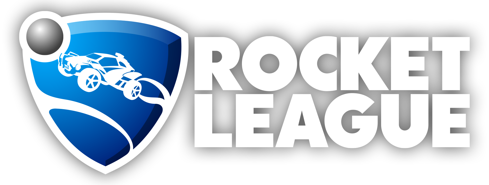

# Proyecto predicción de partidos Rocket League
Rocket League es un videojuego que combina elementos de futbol y carreras de autos, en pocas palabras es un juego donde se debe jugar futbol (metiendo goles en el arco contrario) con autos que al ser propulsados por nitro pueden incluso volar.
Hay distintos modos de juego online y offline, pero este proyecto se centrará en el modo principal en e-sport que es en equipos de 3 vs. 3

Este proyecto está enfocado en realizar un análisis predictivo para saber los ganadores de partidos y resolver un problema de **clasificación** con uno o más dataset extraídos del siguiente link
Link dataset: https://www.kaggle.com/datasets/dylanmonfret/rlcs-202122

Ahora bien, los dataset son datos recogidos de una página especializada en videojuegos competitivos (https://liquipedia.net/rocketleague), por lo tanto, en un futuro quizás sea extraída la información por medio de técnicas de web scraping

- [Glosario](glosario.md)
- [Descripción datasets](datasets/datasets.md)

---
La limpieza y análisis por datasets separados son los siguientes:

- [matches_by_teams](datasets/matches_by_teams.md)
- [matches_by_players](datasets/matches_by_players.md)

---

Si deseas ver una presentación de este proyecto, puedes revisarlo en [Google Drive](https://docs.google.com/presentation/d/1QegdHyBYc0xT62N5MxzHSMcvAFM0RhW-uezhPkkTVvM/edit?usp=sharing)