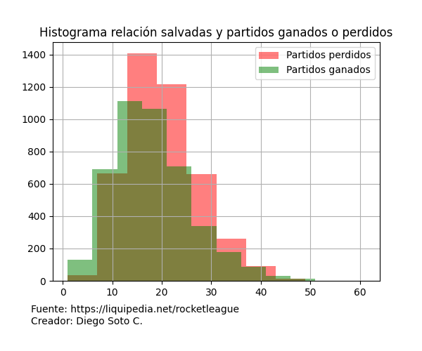

# Proyecto predicción de partidos Rocket League
Rocket League es un videojuego que combina elementos de futbol y carreras de autos, en pocas palabras es un juego donde se debe jugar futbol (metiendo goles en el arco contrario) con autos que al ser propulsados por nitro pueden incluso volar.
Hay distintos modos de juego online y offline, pero este proyecto se centrará en el modo principal en e-sport que es en equipos de 3 vs. 3

Este proyecto está enfocado en realizar un análisis predictivo para saber los ganadores de partidos y resolver un problema de **clasificación** con uno o más dataset extraídos del siguiente link
Link dataset: https://www.kaggle.com/datasets/dylanmonfret/rlcs-202122

Ahora bien, los dataset son datos recogidos de una página especializada en videojuegos competitivos (https://liquipedia.net/rocketleague), por lo tanto, en un futuro quizás sea extraída la información por medio de técnicas de web scraping

Primero que todo es importante mencionar de manera general como son los torneos de este e-sport, para explicar se utilizará un pequeño glosario.
- _Equipo_: Cada equipo está conformado por 3 integrantes, existen algunos que tienen 4 equipos para tener un recambio, pero poco común.
- _Partido_: Cada partido dura 5 minutos, por cada gol realizado se hace una pequeña pausa en el tiempo mientras se ve una repetición del gol, también se pausará en caso de que alguno de los dos equipos tenga un inconveniente técnico. En el caso de estar empatados al término de los 5 minutos habrá un overtime que terminará solo cuando uno de los 2 equipos haga otro gol.
- _Encuentro_: Cada encuentro está compuesto de un máximo de 5 partidos, es decir, el primer equipo que gana 3 partidos gana el encuentro. Esto cambia en las fases finales de cada campeonato que se juegan en formato eliminatorio, y pasan a tener un máximo de 7 partidos, es decir, el primero que gana 4 partidos gana el encuentro.
- _Regionales_: En cada temporada se juegan encuentros entre equipos de cada región, y luego de diferentes fases hay un equipo ganador acompañado de un premio monetario. Cada encuentro ganado va sumando puntos para clasificar a las siguientes fases, mientras más alta sea la fase que se llegue en el campeonato, más puntos son entregados.
- _Major_: Luego de 3 regionales hay un campeonato internacional, que se clasifican los equipos que tengan más puntos en cada región, este torneo se disputa con 16 equipos en total (nota: no es necesario ser ganador de regional para llegar a este torneo, y también el hecho de ser ganador no garantiza llegar al torneo, todo dependerá del desempeño en los 3 regionales). El formato de este torneo es similar a los regionales, la diferencia es que es internacional, y los puntos y dinero ganado son mayores.
- _Mundial_: Cada temporada (usualmente anual), luego de 3 Major, hay un campeonato similar que clasifican los equipos que tengan más puntos en cada región, y se disputa con 24 equipos en total. Luego de este evento se reinician los puntos, por lo tanto, en estos encuentros no juntan más; sin embargo, el premio monetario es mayor.


La información contenida en los diferentes datasets es la siguiente:
- games_by_players_df: Partidos jugados por cada jugador
- games_by_teams_df: Partidos jugados por cada equipo
- main_df: Base general con los eventos (no hay información detallada)
- matches_by_players_df: Encuentros por cada jugador
- matches_by_teams_df: Encuentros por cada equipo
- players_db_df: Base de datos de jugadores profesionales


# Análisis preliminar
A modo exploratorio se utilizará el df **matches_by_teams_df**, ya que preliminarmente es el que puede tener información más relevante al ser el que guarda lo referente a los encuentros (no a los partidos individuales), sin embargo, es posible utilizar otro basándonos en las necesidades.

## Columnas y tipos (matches_by_teams_df.dtypes)
```text
match_id                               object
color                                  object
team_id                                object
team_slug                              object
team_name                              object
team_region                            object
core_shots                            float64
core_goals                            float64
core_saves                            float64
core_assists                          float64
core_score                            float64
core_shooting_percentage              float64
boost_bpm                             float64
boost_bcpm                            float64
boost_avg_amount                      float64
boost_amount_collected                float64
boost_amount_stolen                   float64
boost_amount_collected_big            float64
boost_amount_stolen_big               float64
boost_amount_collected_small          float64
boost_amount_stolen_small             float64
boost_count_collected_big             float64
boost_count_stolen_big                float64
boost_count_collected_small           float64
boost_count_stolen_small              float64
boost_amount_overfill                 float64
boost_amount_overfill_stolen          float64
boost_amount_used_while_supersonic    float64
boost_time_zero_boost                 float64
boost_time_full_boost                 float64
boost_time_boost_0_25                 float64
boost_time_boost_25_50                float64
boost_time_boost_50_75                float64
boost_time_boost_75_100               float64
movement_total_distance               float64
movement_time_supersonic_speed        float64
movement_time_boost_speed             float64
movement_time_slow_speed              float64
movement_time_ground                  float64
movement_time_low_air                 float64
movement_time_high_air                float64
movement_time_powerslide              float64
movement_count_powerslide             float64
positioning_time_defensive_third      float64
positioning_time_neutral_third        float64
positioning_time_offensive_third      float64
positioning_time_defensive_half       float64
positioning_time_offensive_half       float64
positioning_time_behind_ball          float64
positioning_time_in_front_ball        float64
demo_inflicted                        float64
demo_taken                            float64
score                                 float64
winner                                   bool
dtype: object
```

## Nulos (matches_by_teams_df.isnull().sum())
```text
match_id                                 0
color                                    0
team_id                                  0
team_slug                                0
team_name                                0
team_region                              7
core_shots                            1886
core_goals                            1886
core_saves                            1886
core_assists                          1886
core_score                            1886
core_shooting_percentage              1886
boost_bpm                             1932
boost_bcpm                            1932
boost_avg_amount                      1932
boost_amount_collected                1932
boost_amount_stolen                   1932
boost_amount_collected_big            1932
boost_amount_stolen_big               1932
boost_amount_collected_small          1932
boost_amount_stolen_small             1932
boost_count_collected_big             1932
boost_count_stolen_big                1932
boost_count_collected_small           1932
boost_count_stolen_small              1932
boost_amount_overfill                 1932
boost_amount_overfill_stolen          1932
boost_amount_used_while_supersonic    1932
boost_time_zero_boost                 1932
boost_time_full_boost                 1932
boost_time_boost_0_25                 1932
boost_time_boost_25_50                1932
boost_time_boost_50_75                1932
boost_time_boost_75_100               1932
movement_total_distance               1932
movement_time_supersonic_speed        1932
movement_time_boost_speed             1932
movement_time_slow_speed              1932
movement_time_ground                  1932
movement_time_low_air                 1932
movement_time_high_air                1932
movement_time_powerslide              1932
movement_count_powerslide             1932
positioning_time_defensive_third      1932
positioning_time_neutral_third        1932
positioning_time_offensive_third      1932
positioning_time_defensive_half       1932
positioning_time_offensive_half       1932
positioning_time_behind_ball          1932
positioning_time_in_front_ball        1932
demo_inflicted                        1932
demo_taken                            1932
score                                    0
winner                                   0
dtype: int64
```

La siguiente línea de código, se divide en lo siguiente:
1. Busca los valores nulos dentro del df con el método isnull()
2. Con el método any(axis=1) guarda las posiciones de cada True de isnull
3. Filtra cada posición guardada anteriormente en el df
4. Guarda el resultado en un nuevo df llamado "nulos"
```python
nulos = matches_by_teams_df[matches_by_teams_df.isnull().any(1)]
```

Al verificar manualmente algunas de las filas que están con datos nulos, realmente no existen en la web donde está la base desde donde se realizaría el web scraping, ahora bien, en general en cada columna representaría un 18% (en las que tienen más nulos) que podría afectar en el modelo, por lo tanto, dependiendo de la relación principalmente se rellenarán con la mediana, o de lo contrario se eliminarían

## Limpieza de dataset
Si bien, el dataset cuenta con muchas columnas que se pueden analizar, hay algunas que muestran porcentajes o promedios y realmente no se utilizarían en el modelo y se eliminarán.
Por otro lado, hay columnas que son la suma de otras 2 que muestran un poco más en detalle, por ejemplo, "boost_amount_collected" es la suma de "boost_amount_collected_big" y "boost_amount_collected_small". Si bien con el detalle se podrían hacer un análisis más completo y en detalle con estos datos, realmente no influirían tanto en este modelo, por lo tanto, solo se quedarán las columnas con el total.
Con base en lo anteriormente mencionado, junto con otros factores, se optará por dejar solo las siguientes columnas.
```text
match_id (esto solo se incluirá en el caso que se deba buscar un dato en otro df o en la web)
color
team_id
team_name
team_region
core_shots
core_goals
core_saves
core_assists
core_score
boost_amount_collected
boost_amount_stolen
boost_time_zero_boost
movement_total_distance
movement_time_supersonic_speed
movement_time_boost_speed
movement_time_slow_speed
movement_time_ground
movement_time_low_air
movement_time_high_air
positioning_time_defensive_half
positioning_time_offensive_half
demo_inflicted
demo_taken
score
winner
```
Esta limpieza se realiza en el archivo **datasets.py** que se utilizará como módulo con el fin de limpiar todos los datos y cargarlos en archivos por separado

## Hipótesis preliminar
Inicialmente, hay 3 hipótesis para las que podemos buscar respuestas:
- ¿Hay alguna inclinación en cuanto a los partidos ganados por esquina (azul/naranja) dada?


- ¿Hay una relación entre las salvadas o salvadas épicas realizadas y los partidos ganados?


- ¿Se podría decir que mientras más distancia se recorre, más boost se utiliza?


### Conclusiones preliminares
En base al primer gráfico podemos concluir que hay una clara inclinación que gane la esquina azul, sin embargo no podemos asegurar que no se deba a factures externos, de todas maneras se podría utilizar este parámetro para el modelo de datos que se creará.

Por otro lado, con el segundo gráfico por ahora, no podemos concluir que hay una relación directa o indirecta en cuanto a los partidos ganados o perdidos versus la cantidad de salvadas. De todas maneras, hay frecuencias más altas en los partidos perdidos, esto puede deberse a que realmente hubo más salvadas porque también hubo más defensa, por lo tanto, se podría decir que, la cantidad de partidos perdidos aumenta mientras más salvadas haya porque la mayor parte del tiempo se defendieron de los ataques del oponente.

Por último, gracias al tercer gráfico podemos ver una clara correlación entre el boost recolectado y la distancia recorrida en el campo, de todas maneras, se buscarán outliers para evitar malos resultados a futuro

Para seguir con la exploración de los datos, se dará una nueva visión para todos los gráficos, realmente esto se hará para confirmar que tan correcto podrían estar

---
En primer lugar solo para verificar que tanto influyen los nulos en la agrupación del primer gráfico, se generará otra agrupación, pero del df "nulos" y así se verá que tan diferentes pueden ser los datos

```python
nulos.groupby('winner')[['core_saves']].sum()
```

| core_saves | winner |
| --- | --- |
| False	| 566.0 |
| True | 536.0 |

Se puede apreciar que la diferencia es muy marginal como para considerarla, por lo tanto, el primer gráfico se consideraría correcto

---
En cuanto a lo siguiente, se intentará hacer un diagrama de dispersión que muestre si hay una relación entre los partidos perdidos y las salvadas


Gracias a este gráfico podemos decir que no hay correlación entre los partidos perdidos y las salvadas realizadas, por lo tanto, se puede descartar.

---
Por último, por el tercer gráfico donde se apreció una relación entre el boost recolectado y la distancia recorrida, se buscarán outliers con un gráfico de cajas y bigote


Gracias a estos últimos gráficos se puede apreciar que en ambos casos la concentración mayor en outliers superiores. Ahora bien, considerando que en ambas variables esto se repite lo podríamos clasificar como outliers colectivos y no necesariamente una suciedad en la base, por lo tanto, podría abrir la posibilidad a otros fenómenos que se estudiarán más adelante

# Parte 2
En la segunda parte intentaré resolver las siguientes preguntas de análisis
- ¿Cuáles son los equipos que más partidos ganaron?
- ¿En qué regiones se encuentran?

Al realizar el análisis de forma general y ver los primeros 10 equipos que ganaron más partidos, da para pensar, ya que al ser un torneo pasado, ya se saben los resultados, el ganador fue "TEAM BDS" que está en tercer lugar con más partidos ganados, y el que está en segundo lugar "TOKYO VERDY ESPORTS", en el general quedó solo entre los 20 mejores, por lo tanto, puede ser que no tenga mucha relación si lo vemos desde ese punto de vista. Ahora bien, se podría hacer el mismo análisis separado por región

```text
Resultados para la región: Oceania

         team_name  winner team_region
         RENEGADES      49     Oceania
GROUND ZERO GAMING      37     Oceania
       DIRE WOLVES      33     Oceania
         FORKIDDEN      29     Oceania
       BANDITS ESC      23     Oceania
       R!OT GAMING      23     Oceania
        TEAM BLISS      23     Oceania
         BIG GOOSE      22     Oceania
          PIONEERS      22     Oceania
        PHYSICISTS      21     Oceania


Resultados para la región: North America

          team_name  winner   team_region
         G2 ESPORTS      62 North America
        NRG ESPORTS      51 North America
          FAZE CLAN      47 North America
           VERSION1      46 North America
SPACESTATION GAMING      45 North America
              ROGUE      40 North America
 SUSQUEHANNA SONIQS      37 North America
       GHOST GAMING      32 North America
     OXYGEN ESPORTS      31 North America
          TEAM ENVY      31 North America


Resultados para la región: Asia-Pacific South

            team_name  winner        team_region
                  NSF      27 Asia-Pacific South
    DARK RIFT ESPORTS      27 Asia-Pacific South
        FROST ESPORTS      23 Asia-Pacific South
           ASIA MANJI      21 Asia-Pacific South
           THREE RATS      19 Asia-Pacific South
            GOD SPEED      18 Asia-Pacific South
FRIENDLY FIRE ESPORTS      18 Asia-Pacific South
              SHOGUNS      16 Asia-Pacific South
     ASPHYX'S MINIONS      15 Asia-Pacific South
    GAIMIN GLADIATORS      15 Asia-Pacific South


Resultados para la región: Middle East & North Africa

      team_name  winner                team_region
   TEAM FALCONS      46 Middle East & North Africa
SANDROCK GAMING      45 Middle East & North Africa
          ANKAA      34 Middle East & North Africa
  THE ULTIMATES      28 Middle East & North Africa
      25ESPORTS      26 Middle East & North Africa
     REVOLUTION      21 Middle East & North Africa
           COLA      20 Middle East & North Africa
         SCYTES      19 Middle East & North Africa
YOU'RE THROWING      18 Middle East & North Africa
 FOREST HUNTERS      17 Middle East & North Africa


Resultados para la región: Europe

       team_name  winner team_region
        TEAM BDS      56      Europe
      TEAM QUESO      46      Europe
        DIGNITAS      43      Europe
    KARMINE CORP      40      Europe
        ENDPOINT      37      Europe
   GUILD ESPORTS      37      Europe
   EVIL GENIUSES      35      Europe
    SMPR ESPORTS      33      Europe
       00 NATION      32      Europe
WILLIAMS RESOLVE      29      Europe


Resultados para la región: South America

     team_name  winner   team_region
 FURIA ESPORTS      56 South America
   KRÜ ESPORTS      37 South America
    NOVUS AEVI      32 South America
       ELEVATE      31 South America
  ERA ETERNITY      31 South America
       ENDGAME      29 South America
VIPERS ESPORTS      29 South America
 NOBLE ESPORTS      28 South America
      ATYPICAL      24 South America
  TRUE NEUTRAL      22 South America


Resultados para la región: Asia-Pacific North

          team_name  winner        team_region
TOKYO VERDY ESPORTS      60 Asia-Pacific North
          DETONATOR      48 Asia-Pacific North
          SHIROGANE      33 Asia-Pacific North
       TEAM GANDERS      32 Asia-Pacific North
                NOR      32 Asia-Pacific North
            NIMMT55      30 Asia-Pacific North
              ALOHA      29 Asia-Pacific North
       TRUE PARROTS      29 Asia-Pacific North
 GRACESBLAZE REFINE      26 Asia-Pacific North
           XAYFHERS      26 Asia-Pacific North


Resultados para la región: Sub-Saharan Africa

         team_name  winner        team_region
     PIRATES EXDEE      53 Sub-Saharan Africa
    BRAVADO GAMING      40 Sub-Saharan Africa
               ATK      34 Sub-Saharan Africa
    TEAM ESPIONAGE      25 Sub-Saharan Africa
       AIPX GAMING      25 Sub-Saharan Africa
      DNMK ESPORTS      23 Sub-Saharan Africa
               PWB      20 Sub-Saharan Africa
             UNITY      20 Sub-Saharan Africa
   ROYALTY ESPORTS      18 Sub-Saharan Africa
LOST LEGION GIANTS      17 Sub-Saharan Africa


Resultados para la región: nan

Empty DataFrame
Columns: [winner, team_name, team_region]
Index: []
```
