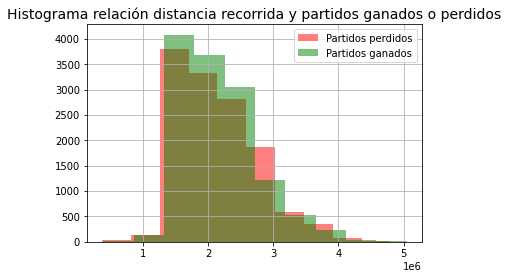

# Análisis preliminar
Preliminarmente se analizará el df **matches_by_players** que tiene las siguientes columnas
```text
<class 'pandas.core.frame.DataFrame'>
RangeIndex: 26176 entries, 0 to 26175
Data columns (total 90 columns):
 #   Column                                          Non-Null Count  Dtype  
---  ------                                          --------------  -----  
 0   match_id                                        26176 non-null  object 
 1   team_id                                         26176 non-null  object 
 2   team_region                                     26155 non-null  object 
 3   player_id                                       26176 non-null  object 
 4   player_tag                                      26176 non-null  object 
 5   core_shots                                      26176 non-null  float64
 6   core_goals                                      26176 non-null  float64
 7   core_saves                                      26176 non-null  float64
 8   core_assists                                    26176 non-null  float64
 9   core_score                                      26176 non-null  float64
 10  core_shooting_percentage                        26176 non-null  float64
 11  boost_bpm                                       26036 non-null  float64
 12  boost_bcpm                                      26036 non-null  float64
 13  boost_avg_amount                                26036 non-null  float64
 14  boost_amount_collected                          26036 non-null  float64
 15  boost_amount_stolen                             26036 non-null  float64
 16  boost_amount_collected_big                      26036 non-null  float64
 17  boost_amount_stolen_big                         26036 non-null  float64
 18  boost_amount_collected_small                    26036 non-null  float64
 19  boost_amount_stolen_small                       26036 non-null  float64
 20  boost_count_collected_big                       26036 non-null  float64
 21  boost_count_stolen_big                          26036 non-null  float64
 22  boost_count_collected_small                     26036 non-null  float64
 23  boost_count_stolen_small                        26036 non-null  float64
 24  boost_amount_overfill                           26036 non-null  float64
 25  boost_amount_overfill_stolen                    26036 non-null  float64
 26  boost_amount_used_while_supersonic              26036 non-null  float64
 27  boost_time_zero_boost                           26036 non-null  float64
 28  boost_percent_zero_boost                        26036 non-null  float64
 29  boost_time_full_boost                           26036 non-null  float64
 30  boost_percent_full_boost                        26036 non-null  float64
 31  boost_time_boost_0_25                           26036 non-null  float64
 32  boost_time_boost_25_50                          26036 non-null  float64
 33  boost_time_boost_50_75                          26036 non-null  float64
 34  boost_time_boost_75_100                         26036 non-null  float64
 35  boost_percent_boost_0_25                        26036 non-null  float64
 36  boost_percent_boost_25_50                       26036 non-null  float64
 37  boost_percent_boost_50_75                       26036 non-null  float64
 38  boost_percent_boost_75_100                      26036 non-null  float64
 39  movement_avg_speed                              26036 non-null  float64
 40  movement_total_distance                         26036 non-null  float64
 41  movement_time_supersonic_speed                  26036 non-null  float64
 42  movement_time_boost_speed                       26036 non-null  float64
 43  movement_time_slow_speed                        26036 non-null  float64
 44  movement_time_ground                            26036 non-null  float64
 45  movement_time_low_air                           26036 non-null  float64
 46  movement_time_high_air                          26036 non-null  float64
 47  movement_time_powerslide                        26036 non-null  float64
 48  movement_count_powerslide                       26036 non-null  float64
 49  movement_avg_powerslide_duration                26036 non-null  float64
 50  movement_avg_speed_percentage                   26036 non-null  float64
 51  movement_percent_slow_speed                     26036 non-null  float64
 52  movement_percent_boost_speed                    26036 non-null  float64
 53  movement_percent_supersonic_speed               26036 non-null  float64
 54  movement_percent_ground                         26036 non-null  float64
 55  movement_percent_low_air                        26036 non-null  float64
 56  movement_percent_high_air                       26036 non-null  float64
 57  positioning_avg_distance_to_ball                26036 non-null  float64
 58  positioning_avg_distance_to_ball_possession     26036 non-null  float64
 59  positioning_avg_distance_to_ball_no_possession  26036 non-null  float64
 60  positioning_avg_distance_to_mates               26036 non-null  float64
 61  positioning_time_defensive_third                26036 non-null  float64
 62  positioning_time_neutral_third                  26036 non-null  float64
 63  positioning_time_offensive_third                26036 non-null  float64
 64  positioning_time_defensive_half                 26036 non-null  float64
 65  positioning_time_offensive_half                 26036 non-null  float64
 66  positioning_time_behind_ball                    26036 non-null  float64
 67  positioning_time_in_front_ball                  26036 non-null  float64
 68  positioning_time_most_back                      26036 non-null  float64
 69  positioning_time_most_forward                   26036 non-null  float64
 70  positioning_goals_against_while_last_defender   26036 non-null  float64
 71  positioning_time_closest_to_ball                26036 non-null  float64
 72  positioning_time_farthest_from_ball             26036 non-null  float64
 73  positioning_percent_defensive_third             26036 non-null  float64
 74  positioning_percent_offensive_third             26036 non-null  float64
 75  positioning_percent_neutral_third               26036 non-null  float64
 76  positioning_percent_defensive_half              26036 non-null  float64
 77  positioning_percent_offensive_half              26036 non-null  float64
 78  positioning_percent_behind_ball                 26036 non-null  float64
 79  positioning_percent_in_front_ball               26036 non-null  float64
 80  positioning_percent_most_back                   26036 non-null  float64
 81  positioning_percent_most_forward                26036 non-null  float64
 82  positioning_percent_closest_to_ball             26036 non-null  float64
 83  positioning_percent_farthest_from_ball          26036 non-null  float64
 84  demo_inflicted                                  26036 non-null  float64
 85  demo_taken                                      26036 non-null  float64
 86  advanced_goal_participation                     26176 non-null  float64
 87  advanced_rating                                 26176 non-null  float64
 88  score                                           26176 non-null  float64
 89  winner                                          26176 non-null  bool   
dtypes: bool(1), float64(84), object(5)
memory usage: 17.8+ MB
```
La mayoría de las columnas tienen datos de porcentajes o son un conjunto de otras, por lo tanto solo se mantendrán algunas, estas de todas maneras tienen datos nulos:
```python
matches_by_players_df.isnull().sum()
```
**output**
```text
match_id                             0
team_id                              0
team_region                         21
player_id                            0
player_tag                           0
core_shots                           0
core_goals                           0
core_score                           0
boost_amount_collected             140
boost_amount_stolen                140
boost_time_zero_boost              140
movement_total_distance            140
movement_time_supersonic_speed     140
movement_time_boost_speed          140
movement_time_slow_speed           140
movement_time_ground               140
movement_time_low_air              140
movement_time_high_air             140
positioning_time_defensive_half    140
positioning_time_offensive_half    140
demo_inflicted                     140
demo_taken                         140
score                                0
winner                               0
```

# Hipótesis preliminares
Debido a que el proyecto es para buscar posibles ganadores, lo idela es buscar relaciones entre los ganados y algo más, por lo tanto las primeras preguntas a resolver son:

- ¿Hay alguna relación entre la distancia recorrida y la cantidad de partidos ganados?
- ¿Hay alguna relación entre el boost recolectado y los partidos ganados?
- ¿El tiempo total en el aire influye en la cantidad de partidos ganados?

Para contestar esto se realizarán distintos gráficos y tablas.

Lo primero fue sacar un promedio de movement_total_distance en base a lo ganado y lo perdido
La diferencias es ínfima, la distancia promedio recorrida en partidos perdidos es de **2066229.5** y en ganados es de **2085005** incluso en un gráfico de barras es difícil de dilucidar. Para aclarar un poco más se creo un histograma entre ambas variables, el resultado es el siguiente:
